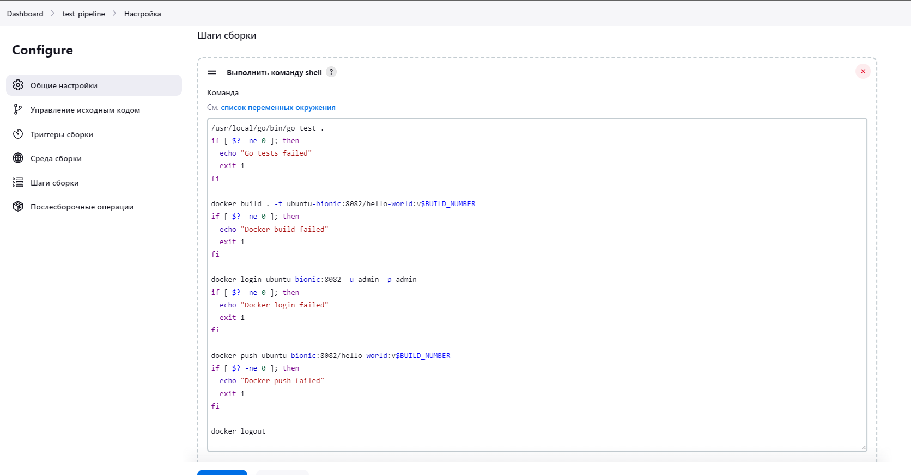
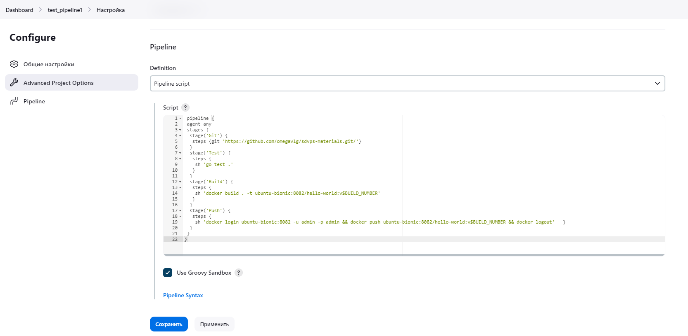
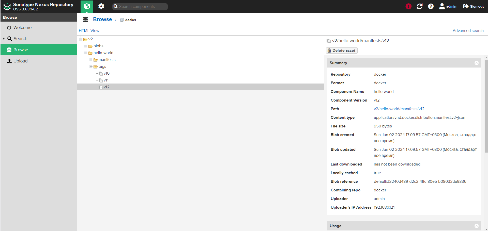
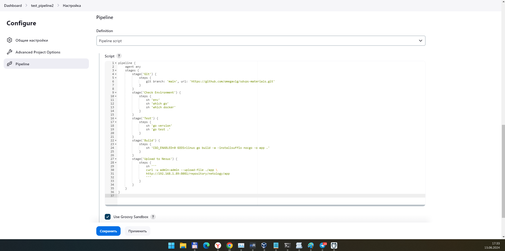
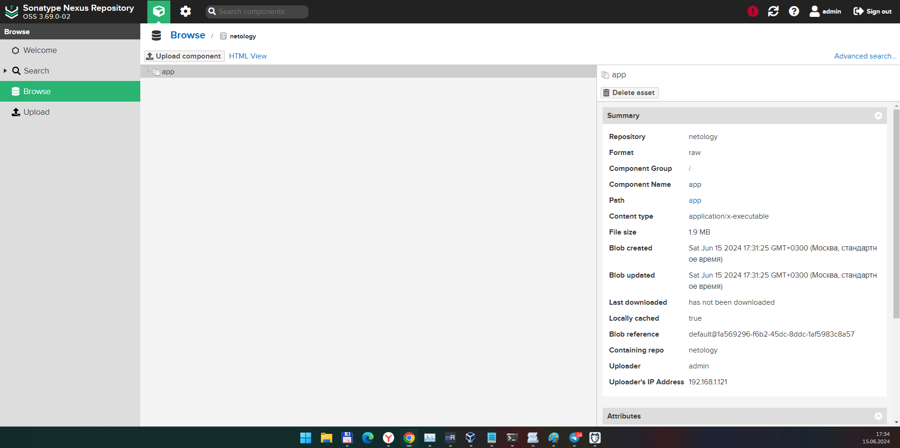

# Домашнее задание к занятию "`Что такое DevOps. СI/СD`" - `Дедюрин Денис`


### Инструкция по выполнению домашнего задания

   1. Сделайте `fork` данного репозитория к себе в Github и переименуйте его по названию или номеру занятия, например, https://github.com/имя-вашего-репозитория/git-hw или  https://github.com/имя-вашего-репозитория/7-1-ansible-hw).
   2. Выполните клонирование данного репозитория к себе на ПК с помощью команды `git clone`.
   3. Выполните домашнее задание и заполните у себя локально этот файл README.md:
      - впишите вверху название занятия и вашу фамилию и имя
      - в каждом задании добавьте решение в требуемом виде (текст/код/скриншоты/ссылка)
      - для корректного добавления скриншотов воспользуйтесь [инструкцией "Как вставить скриншот в шаблон с решением](https://github.com/netology-code/sys-pattern-homework/blob/main/screen-instruction.md)
      - при оформлении используйте возможности языка разметки md (коротко об этом можно посмотреть в [инструкции  по MarkDown](https://github.com/netology-code/sys-pattern-homework/blob/main/md-instruction.md))
   4. После завершения работы над домашним заданием сделайте коммит (`git commit -m "comment"`) и отправьте его на Github (`git push origin`);
   5. Для проверки домашнего задания преподавателем в личном кабинете прикрепите и отправьте ссылку на решение в виде md-файла в вашем Github.
   6. Любые вопросы по выполнению заданий спрашивайте в чате учебной группы и/или в разделе “Вопросы по заданию” в личном кабинете.
   
Желаем успехов в выполнении домашнего задания!
   
### Дополнительные материалы, которые могут быть полезны для выполнения задания

1. [Руководство по оформлению Markdown файлов](https://gist.github.com/Jekins/2bf2d0638163f1294637#Code)

---

### Задание 1

Настройка pipllene:


Результат выполнения сборки:
```
Started by user admin adminov
Running as SYSTEM
Building in workspace /var/lib/jenkins/workspace/test_pipeline
The recommended git tool is: NONE
No credentials specified
 > git rev-parse --resolve-git-dir /var/lib/jenkins/workspace/test_pipeline/.git # timeout=10
Fetching changes from the remote Git repository
 > git config remote.origin.url https://github.com/omegavlg/sdvps-materials.git # timeout=10
Fetching upstream changes from https://github.com/omegavlg/sdvps-materials.git
 > git --version # timeout=10
 > git --version # 'git version 2.43.0'
 > git fetch --tags --force --progress -- https://github.com/omegavlg/sdvps-materials.git +refs/heads/*:refs/remotes/origin/* # timeout=10
 > git rev-parse refs/remotes/origin/main^{commit} # timeout=10
Checking out Revision 223dbc3f489784448004e020f2ef224f17a7b06d (refs/remotes/origin/main)
 > git config core.sparsecheckout # timeout=10
 > git checkout -f 223dbc3f489784448004e020f2ef224f17a7b06d # timeout=10
Commit message: "Update README.md"
 > git rev-list --no-walk 223dbc3f489784448004e020f2ef224f17a7b06d # timeout=10
[test_pipeline] $ /bin/sh -xe /tmp/jenkins6150308290863408573.sh
+ /usr/local/go/bin/go test .
ok  	github.com/netology-code/sdvps-materials	(cached)
+ '[' 0 -ne 0 ']'
+ docker build . -t ubuntu-bionic:8082/hello-world:v10
#0 building with "default" instance using docker driver

#1 [internal] load build definition from Dockerfile
#1 transferring dockerfile: 403B 0.0s done
#1 DONE 0.0s

#2 [internal] load metadata for docker.io/library/alpine:latest
#2 DONE 0.7s

#3 [internal] load metadata for docker.io/library/golang:1.16
#3 DONE 0.7s

#4 [internal] load .dockerignore
#4 transferring context: 2B done
#4 DONE 0.1s

#5 [stage-1 1/3] FROM docker.io/library/alpine:latest@sha256:77726ef6b57ddf65bb551896826ec38bc3e53f75cdde31354fbffb4f25238ebd
#5 DONE 0.0s

#6 [builder 1/4] FROM docker.io/library/golang:1.16@sha256:5f6a4662de3efc6d6bb812d02e9de3d8698eea16b8eb7281f03e6f3e8383018e
#6 DONE 0.0s

#7 [internal] load build context
#7 DONE 0.0s

#7 [internal] load build context
#7 transferring context: 25.32kB 0.1s done
#7 DONE 0.1s

#8 [builder 2/4] WORKDIR /go/src/github.com/netology-code/sdvps-materials
#8 CACHED

#9 [builder 3/4] COPY . ./
#9 CACHED

#10 [builder 4/4] RUN CGO_ENABLED=0 GOOS=linux go build -a -installsuffix nocgo -o /app .
#10 CACHED

#11 [stage-1 2/3] RUN apk -U add ca-certificates
#11 CACHED

#12 [stage-1 3/3] COPY --from=builder /app /app
#12 CACHED

#13 exporting to image
#13 exporting layers done
#13 writing image sha256:5a31265584bb5fcc37cd29447134217a8ef81f433d2fc93fa2b130f9edd9bae8 done
#13 naming to ubuntu-bionic:8082/hello-world:v10 0.0s done
#13 DONE 0.1s
+ '[' 0 -ne 0 ']'
+ docker login ubuntu-bionic:8082 -u admin -p admin
WARNING! Using --password via the CLI is insecure. Use --password-stdin.
WARNING! Your password will be stored unencrypted in /var/lib/jenkins/.docker/config.json.
Configure a credential helper to remove this warning. See
https://docs.docker.com/engine/reference/commandline/login/#credentials-store

Login Succeeded
+ '[' 0 -ne 0 ']'
+ docker push ubuntu-bionic:8082/hello-world:v10
The push refers to repository [ubuntu-bionic:8082/hello-world]
f0ac3ce2c57d: Preparing
fa053ea2b445: Preparing
02f2bcb26af5: Preparing
fa053ea2b445: Pushed
f0ac3ce2c57d: Pushed
02f2bcb26af5: Pushed
v10: digest: sha256:5351b59b4a58586c0fc350ff0e545eb3319aeba35f8fc1a1226bd02746af468c size: 950
+ '[' 0 -ne 0 ']'
+ docker logout
Removing login credentials for https://index.docker.io/v1/
Finished: SUCCESS
```
---

### Задание 2
Настройка pipllene:


Результат выполнения сборки:
```
Started by user admin adminov
[Pipeline] Start of Pipeline
[Pipeline] node
Running on Jenkins in /var/lib/jenkins/workspace/test_pipeline1
[Pipeline] {
[Pipeline] stage
[Pipeline] { (Git)
[Pipeline] git
The recommended git tool is: NONE
No credentials specified
 > git rev-parse --resolve-git-dir /var/lib/jenkins/workspace/test_pipeline1/.git # timeout=10
Fetching changes from the remote Git repository
 > git config remote.origin.url https://github.com/omegavlg/sdvps-materials.git/ # timeout=10
Fetching upstream changes from https://github.com/omegavlg/sdvps-materials.git/
 > git --version # timeout=10
 > git --version # 'git version 2.43.0'
 > git fetch --tags --force --progress -- https://github.com/omegavlg/sdvps-materials.git/ +refs/heads/*:refs/remotes/origin/* # timeout=10
 > git rev-parse refs/remotes/origin/master^{commit} # timeout=10
Checking out Revision da5acf7bcb7f437637adf06fbd03a24dc2c8f13e (refs/remotes/origin/master)
 > git config core.sparsecheckout # timeout=10
 > git checkout -f da5acf7bcb7f437637adf06fbd03a24dc2c8f13e # timeout=10
 > git branch -a -v --no-abbrev # timeout=10
 > git branch -D master # timeout=10
 > git checkout -b master da5acf7bcb7f437637adf06fbd03a24dc2c8f13e # timeout=10
Commit message: "branch main, add creds for vagrant box"
 > git rev-list --no-walk da5acf7bcb7f437637adf06fbd03a24dc2c8f13e # timeout=10
[Pipeline] }
[Pipeline] // stage
[Pipeline] stage
[Pipeline] { (Test)
[Pipeline] sh
+ go test .
ok  	github.com/netology-code/sdvps-materials	(cached)
[Pipeline] }
[Pipeline] // stage
[Pipeline] stage
[Pipeline] { (Build)
[Pipeline] sh
+ docker build . -t ubuntu-bionic:8082/hello-world:v12
#0 building with "default" instance using docker driver

#1 [internal] load build definition from Dockerfile
#1 transferring dockerfile: 403B done
#1 DONE 0.0s

#2 [internal] load metadata for docker.io/library/golang:1.16
#2 DONE 0.6s

#3 [internal] load metadata for docker.io/library/alpine:latest
#3 DONE 0.7s

#4 [internal] load .dockerignore
#4 transferring context: 2B done
#4 DONE 0.0s

#5 [builder 1/4] FROM docker.io/library/golang:1.16@sha256:5f6a4662de3efc6d6bb812d02e9de3d8698eea16b8eb7281f03e6f3e8383018e
#5 DONE 0.0s

#6 [stage-1 1/3] FROM docker.io/library/alpine:latest@sha256:77726ef6b57ddf65bb551896826ec38bc3e53f75cdde31354fbffb4f25238ebd
#6 DONE 0.0s

#7 [internal] load build context
#7 transferring context: 30.43kB 0.0s done
#7 DONE 0.1s

#8 [builder 2/4] WORKDIR /go/src/github.com/netology-code/sdvps-materials
#8 CACHED

#9 [builder 3/4] COPY . ./
#9 DONE 0.1s

#10 [builder 4/4] RUN CGO_ENABLED=0 GOOS=linux go build -a -installsuffix nocgo -o /app .
#10 DONE 13.3s

#11 [stage-1 2/3] RUN apk -U add ca-certificates
#11 CACHED

#12 [stage-1 3/3] COPY --from=builder /app /app
#12 CACHED

#13 exporting to image
#13 exporting layers done
#13 writing image sha256:5a31265584bb5fcc37cd29447134217a8ef81f433d2fc93fa2b130f9edd9bae8 done
#13 naming to ubuntu-bionic:8082/hello-world:v12 0.0s done
#13 DONE 0.0s
[Pipeline] }
[Pipeline] // stage
[Pipeline] stage
[Pipeline] { (Push)
[Pipeline] sh
+ docker login ubuntu-bionic:8082 -u admin -p admin
WARNING! Using --password via the CLI is insecure. Use --password-stdin.
WARNING! Your password will be stored unencrypted in /var/lib/jenkins/.docker/config.json.
Configure a credential helper to remove this warning. See
https://docs.docker.com/engine/reference/commandline/login/#credentials-store

Login Succeeded
+ docker push ubuntu-bionic:8082/hello-world:v12
The push refers to repository [ubuntu-bionic:8082/hello-world]
f0ac3ce2c57d: Preparing
fa053ea2b445: Preparing
02f2bcb26af5: Preparing
02f2bcb26af5: Layer already exists
fa053ea2b445: Layer already exists
f0ac3ce2c57d: Layer already exists
v12: digest: sha256:5351b59b4a58586c0fc350ff0e545eb3319aeba35f8fc1a1226bd02746af468c size: 950
+ docker logout
Removing login credentials for https://index.docker.io/v1/
[Pipeline] }
[Pipeline] // stage
[Pipeline] }
[Pipeline] // node
[Pipeline] End of Pipeline
Finished: SUCCESS
```



---

### Задание 3
Настройка pipllene:


Результат выполнения сборки:

```
Started by user admin adminov
[Pipeline] Start of Pipeline
[Pipeline] node
Running on Jenkins in /var/lib/jenkins/workspace/test_pipeline2
[Pipeline] {
[Pipeline] stage
[Pipeline] { (Git)
[Pipeline] git
The recommended git tool is: NONE
No credentials specified
 > git rev-parse --resolve-git-dir /var/lib/jenkins/workspace/test_pipeline2/.git # timeout=10
Fetching changes from the remote Git repository
 > git config remote.origin.url https://github.com/omegavlg/sdvps-materials.git # timeout=10
Fetching upstream changes from https://github.com/omegavlg/sdvps-materials.git
 > git --version # timeout=10
 > git --version # 'git version 2.43.0'
 > git fetch --tags --force --progress -- https://github.com/omegavlg/sdvps-materials.git +refs/heads/*:refs/remotes/origin/* # timeout=10
 > git rev-parse refs/remotes/origin/main^{commit} # timeout=10
Checking out Revision 223dbc3f489784448004e020f2ef224f17a7b06d (refs/remotes/origin/main)
 > git config core.sparsecheckout # timeout=10
 > git checkout -f 223dbc3f489784448004e020f2ef224f17a7b06d # timeout=10
 > git branch -a -v --no-abbrev # timeout=10
 > git branch -D main # timeout=10
 > git checkout -b main 223dbc3f489784448004e020f2ef224f17a7b06d # timeout=10
Commit message: "Update README.md"
 > git rev-list --no-walk 223dbc3f489784448004e020f2ef224f17a7b06d # timeout=10
[Pipeline] }
[Pipeline] // stage
[Pipeline] stage
[Pipeline] { (Check Environment)
[Pipeline] sh
+ env
RUN_DISPLAY_URL=http://192.168.1.121:8080/job/test_pipeline2/3/display/redirect
JENKINS_URL=http://192.168.1.121:8080/
EXECUTOR_NUMBER=0
_=/usr/bin/env
LANG=en_US.UTF-8
BUILD_ID=3
RUN_CHANGES_DISPLAY_URL=http://192.168.1.121:8080/job/test_pipeline2/3/display/redirect?page=changes
INVOCATION_ID=28a645fdf5be4f2e96b5cb2127f69931
JENKINS_NODE_COOKIE=1c389413-bf9a-4701-a8dc-8ea84576f7fd
JOB_BASE_NAME=test_pipeline2
WORKSPACE_TMP=/var/lib/jenkins/workspace/test_pipeline2@tmp
NOTIFY_SOCKET=/run/systemd/notify
CI=true
HUDSON_COOKIE=a61787c2-0a6b-4d86-8cb7-5c26c8cd4e40
USER=jenkins
BUILD_NUMBER=3
WORKSPACE=/var/lib/jenkins/workspace/test_pipeline2
PWD=/var/lib/jenkins/workspace/test_pipeline2
HUDSON_URL=http://192.168.1.121:8080/
HOME=/var/lib/jenkins
NODE_NAME=built-in
JOURNAL_STREAM=9:60167
HUDSON_SERVER_COOKIE=40f9c603f232503c
JENKINS_HOME=/var/lib/jenkins
JOB_NAME=test_pipeline2
RUN_TESTS_DISPLAY_URL=http://192.168.1.121:8080/job/test_pipeline2/3/display/redirect?page=tests
HUDSON_HOME=/var/lib/jenkins
JOB_DISPLAY_URL=http://192.168.1.121:8080/job/test_pipeline2/display/redirect
RUN_ARTIFACTS_DISPLAY_URL=http://192.168.1.121:8080/job/test_pipeline2/3/display/redirect?page=artifacts
BUILD_URL=http://192.168.1.121:8080/job/test_pipeline2/3/
SHELL=/bin/bash
STAGE_NAME=Check Environment
JOB_URL=http://192.168.1.121:8080/job/test_pipeline2/
BUILD_DISPLAY_NAME=#3
SHLVL=2
BUILD_TAG=jenkins-test_pipeline2-3
NODE_LABELS=built-in
LOGNAME=jenkins
PATH=/usr/local/go/bin:/usr/local/sbin:/usr/local/bin:/usr/sbin:/usr/bin
JENKINS_SERVER_COOKIE=durable-773f97248c4dc763bf557bb6906ec11c0db49afa937479f0b082915636524302
[Pipeline] sh
+ which go
/usr/local/go/bin/go
[Pipeline] sh
+ which docker
/usr/bin/docker
[Pipeline] }
[Pipeline] // stage
[Pipeline] stage
[Pipeline] { (Test)
[Pipeline] sh
+ go version
go version go1.22.3 linux/amd64
[Pipeline] sh
+ go test .
ok  	github.com/netology-code/sdvps-materials	(cached)
[Pipeline] }
[Pipeline] // stage
[Pipeline] stage
[Pipeline] { (Build)
[Pipeline] sh
+ CGO_ENABLED=0
+ GOOS=linux
+ go build -a -installsuffix nocgo -o app .
[Pipeline] }
[Pipeline] // stage
[Pipeline] stage
[Pipeline] { (Upload to Nexus)
[Pipeline] sh
+ curl -u admin:admin --upload-file ./app http://192.168.1.89:8081/repository/netology/app
  % Total    % Received % Xferd  Average Speed   Time    Time     Time  Current
                                 Dload  Upload   Total   Spent    Left  Speed
  0     0    0     0    0     0      0      0 --:--:-- --:--:-- --:--:--     0
100 1964k    0     0  100 1964k      0  2989k --:--:-- --:--:-- --:--:-- 3008k
100 1964k    0     0  100 1964k      0  2989k --:--:-- --:--:-- --:--:-- 3008k
[Pipeline] }
[Pipeline] // stage
[Pipeline] }
[Pipeline] // node
[Pipeline] End of Pipeline
Finished: SUCCESS
```


